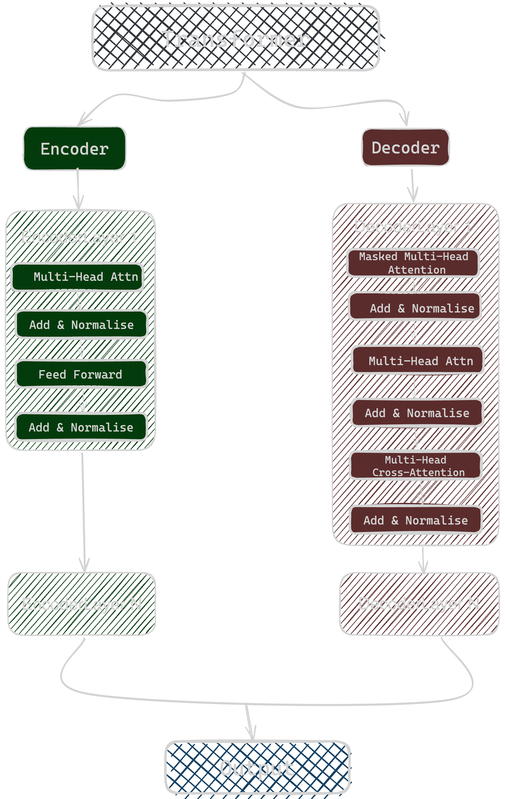

# Transformer from Scratch

The Transformer architecture, introduced in the paper "Attention Is All You Need," has become a cornerstone of many natural language processing tasks, this project implements a Transformer model from scratch using PyTorch. 

## Model Architecture

The Transformer model consists of the following components:

1. Encoder
2. Decoder
3. Multi-Head Attention
4. Position-wise Feed-Forward Networks
5. Positional Encoding



## Project Structure

- `src/`: Contains the source code for the Transformer model
  - `model/`: Transformer model components
  - `utils/`: Utility functions for data processing
  - `train.py`: Script for training the Transformer
  - `translate.py`: Script for using the trained model for translation
- `tests/`: Unit tests for model components
- `data/`: Directory to store dataset files
- `vocab/`: Directory to store vocabulary files

## Setup

1. Clone the repository:
   ```
   git clone https://github.com/yourusername/transformer-from-scratch.git
   cd transformer-from-scratch
   ```

2. Create a virtual environment:
   ```
   python -m venv transformer
   ```

3. Activate the virtual environment:
   - On Windows: `transformer\Scripts\activate`
   - On macOS and Linux: `source transformer/bin/activate`

4. Install dependencies:
   ```
   pip install -r requirements.txt
   ```

## Usage

### Preparing the Data

1. Place your English sentences in `data/english_sentences.txt` and French sentences in `data/french_sentences.txt`.

2. Create vocabularies:
   ```
   python src/create_vocab.py
   ```

### Training the Model

To train the Transformer model, run:

```
python src/train.py
```

This will start the training process and save the model checkpoints in the `saved_models` directory.

### Translating Sentences

After training the model, you can use it for translation:

```
python src/translate.py
```

Example usage in your code:

```python
from src.translate import Translator

translator = Translator(
    model_path="saved_models/final_model.pth",
    src_vocab_path="vocab/english.model",
    tgt_vocab_path="vocab/french.model",
    device="cuda"  # or "cpu" if you don't have a GPU
)

english_sentence = "Hello, how are you?"
french_translation = translator.translate(english_sentence)
print(f"English: {english_sentence}")
print(f"French: {french_translation}")
```

## Run in Docker

### Building the Docker Images

```bash
docker-compose build
```

### Running the Services

- To run the training service:

```bash
docker-compose up transformer
```

- To run the translation service:

```bash
docker-compose up translator
```

## Testing [TODO - Ignore for now!]

To run the unit tests, execute:

```
python -m unittest discover tests
```

## Customization

You can customize the model by modifying the hyperparameters in `src/train.py`. The main hyperparameters are:

- `src_vocab_size`: Size of the source vocabulary
- `tgt_vocab_size`: Size of the target vocabulary
- `d_model`: Dimensionality of the model
- `num_heads`: Number of attention heads
- `num_layers`: Number of encoder and decoder layers
- `d_ff`: Dimensionality of the feed-forward network
- `dropout`: Dropout rate
- `max_seq_length`: Maximum sequence length
- `batch_size`: Batch size for training
- `num_epochs`: Number of training epochs
- `learning_rate`: Learning rate for the optimizer

## Dependencies

This project requires the following main dependencies:

- PyTorch
- NumPy
- tqdm
- matplotlib
- sentencepiece

For a complete list of dependencies, please refer to the `requirements.txt` file.

## Contributing

Contributions to this project are welcome. Please feel free to submit a Pull Request.

## License

This project is open source and available under the [MIT License](LICENSE).

## Acknowledgements

- The Transformer architecture is based on the paper ["Attention Is All You Need"](https://arxiv.org/abs/1706.03762) by Vaswani et al.
- This implementation was inspired by various open-source Transformer implementations and tutorials available in the community.